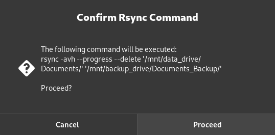

# Rsync GUI

A simple GUI-based Bash script using Zenity to perform easy, interactive folder synchronization via Rsync



## Features

* Select origin and target folders through GUI
* Option to delete files in the target folder not present in the origin
* Provides progress feedback both in GUI and console 

## Requirements

* Bash
* Zenity
* Rsync

## Usage

1. Make the script executable:

   ```bash
   chmod +x rsync_gui.sh
   ```

2. Run the script:

   ```bash
   ./rsync_gui.sh
   ```

## Compatibility

* Tested on Fedora Linux with Zenity installed
